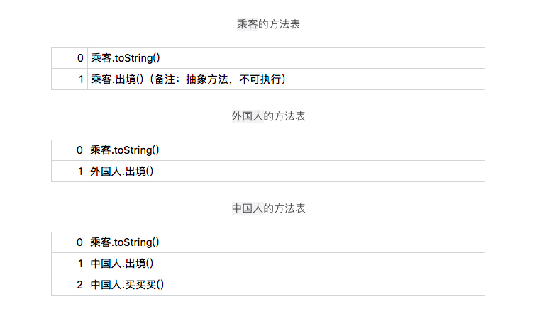

## JVM是如何执行方法调用的？（下）

我在读博士的时候，最怕的事情就是被问有没有新的Idea。有一次我被老板问急了，就随口说了一个。

这个Idea究竟是什么呢，我们知道，设计模式大量使用了虚方法来实现多态。但是虚方法的性能效率并不高，所以我就说，是否能够在此基础上写篇文章，评估每一种设计模式因为虚方法调用而造成的性能开销，并且在文章中强烈谴责一下？

当时呢，我老板教的是一门高级程序设计的课，其中有好几节课刚好在讲设计模式的各种好处。所以，我说完这个Idea，就看到老板的神色略有不悦了，脸上写满了“小郑啊，你这是舍本逐末啊”，于是，我就连忙挽尊，说我是开玩笑的。

在这里呢，我犯的错误其实有两个。第一，我不应该因为虚方法的性能效率，而放弃良好的设计。第二，通常来说，Java虚拟机中虚方法调用的性能开销并不大，有些时候甚至可以完全消除。第一个错误是原则上的，这里就不展开了。至于第二个错误，我们今天便来聊一聊Java虚拟机中虚方法调用的具体实现。

首先，我们来看一个模拟出国边检的小例子。
~~~java
abstract class 乘客 {
    abstract void 出境();
    @Override
    public String toString() { ... }
}
class 外国人 extends 乘客 {
    @Override
    void 出境() { /* 进外国人通道 */ }
}
class 中国人 extends 乘客 {
    @Override
    void 出境() { /* 进中国人通道 */ }
    void 买买买() { /* 逛免税店 */ }
    }
    乘客 某乘客 = ...
    某乘客.出境();
~~~
这里我定义了一个抽象类，叫做“乘客”，这个类中有一个名为“出境”的抽象方法，以及重写自Object类的toString方法。

然后，我将“乘客”粗暴地分为两种：“中国人”以及“外国人”。这两个类分别实现了“出境”这个方法，具体来说，就是中国人走中国人通道，外国人走外国人通道。由于咱们储蓄较多，所以我在“中国人”这个类中，还特意添加了一个叫做“买买买”的方法。

那么在实际运行过程中，Java虚拟机是如何高效地确定每个“乘客”实例应该去哪条通道的呢？我们一起来看一下。

## 1.虚方法调用

在上一篇中我曾经提到，Java里所有非私有实例方法调用都会被编译成invokevirtual指令，而接口方法调用都会被编译成invokeinterface指令。这两种指令，均属于Java虚拟机中的虚方法调用。

在绝大多数情况下，Java虚拟机需要根据调用者的动态类型，来确定虚方法调用的目标方法。这个过程我们称之为动态绑定。那么，相对于静态绑定的非虚方法调用来说，虚方法调用更加耗时。

在Java虚拟机中，静态绑定包括用于调用静态方法的invokestatic指令，和用于调用构造器、私有实例方法以及超类非私有实例方法的invokespecial指令。如果虚方法调用指向一个标记为final的方法，那么Java虚拟机也可以静态绑定该虚方法调用的目标方法。

Java虚拟机中采取了一种用空间换取时间的策略来实现动态绑定。它为每个类生成一张方法表，用以快速定位目标方法。那么方法表具体是怎样实现的呢？

## 2.方法表

在介绍那篇类加载机制的链接部分中，我曾提到类加载的准备阶段，它除了为静态字段分配内存之外，还会构造与该类相关联的方法表。

这个数据结构，便是Java虚拟机实现动态绑定的关键所在。下面我将以invokevirtual所使用的虚方法表（virtual method table，vtable）为例介绍方法表的用法。invokeinterface所使用的接口方法表（interface method table，itable）稍微复杂些，但是原理其实是类似的。

方法表本质上是一个数组，每个数组元素指向一个当前类及其祖先类中非私有的实例方法。

这些方法可能是具体的、可执行的方法，也可能是没有相应字节码的抽象方法。方法表满足两个特质：其一，子类方法表中包含父类方法表中的所有方法；其二，子类方法在方法表中的索引值，与它所重写的父类方法的索引值相同。

我们知道，方法调用指令中的符号引用会在执行之前解析成实际引用。对于静态绑定的方法调用而言，实际引用将指向具体的目标方法。对于动态绑定的方法调用而言，实际引用则是方法表的索引值（实际上并不仅是索引值）

在执行过程中，Java虚拟机将获取调用者的实际类型，并在该实际类型的虚方法表中，根据索引值获得目标方法。这个过程便是动态绑定。

在我们的例子中，“乘客”类的方法表包括两个方法：“toString”以及“出境”，分别对应0号和1号。

之所以方法表调换了“toString”方法和“出境”方法的位置，是因为“toString”方法的索引值需要与Object类中同名方法的索引值一致。为了保持简洁，这里我就不考虑Object类中的其他方法。

“外国人”的方法表同样有两行。其中，0号方法指向继承而来的“乘客”类的“toString”方法。1号方法则指向自己重写的“出境”方法。

“中国人”的方法表则包括三个方法，除了继承而来的“乘客”类的“toString“方法，自己重写的“出境”方法之外，还包括独有的“买买买”方法。
~~~
乘客 某乘客 = ...\n某乘客.出境();
~~~
这里，Java虚拟机的工作可以想象为导航员。每当来了一个乘客需要出境，导航员会先问是中国人还是外国人（获取动态类型），然后翻出中国人\/外国人对应的小册子（获取动态类型的方法表），小册子的第1页便写着应该到哪条通道办理出境手续（用1作为索引来查找方法表所对应的目标方法）。

实际上，使用了方法表的动态绑定与静态绑定相比，仅仅多出几个内存解引用操作：访问栈上的调用者，读取调用者的动态类型，读取该类型的方法表，读取方法表中某个索引值所对应的目标方法。相对于创建并初始化Java栈帧来说，这几个内存解引用操作的开销简直可以忽略不计。

那么我们是否可以认为虚方法调用对性能没有太大影响呢？

其实是不能的，上述优化的效果看上去十分美好，但实际上仅存在于解释执行中，或者即时编译代码的最坏情况中。这是因为即时编译还拥有另外两种性能更好的优化手段：内联缓存（inlining cache）和方法内联（method inlining）。下面我便来介绍第一种内联缓存。

## 3.内联缓存

内联缓存是一种加快动态绑定的优化技术。它能够缓存虚方法调用中调用者的动态类型，以及该类型所对应的目标方法。在之后的执行过程中，如果碰到已缓存的类型，内联缓存便会直接调用该类型所对应的目标方法。如果没有碰到已缓存的类型，内联缓存则会退化至使用基于方法表的动态绑定。

在我们的例子中，这相当于导航员记住了上一个出境乘客的国籍和对应的通道，例如中国人，走了左边通道出境。那么下一个乘客想要出境的时候，导航员会先问是不是中国人，是的话就走左边通道。如果不是的话，只好拿出外国人的小册子，翻到第1页，再告知查询结果：右边。

在针对多态的优化手段中，我们通常会提及以下三个术语。

单态（monomorphic）指的是仅有一种状态的情况。

多态（polymorphic）指的是有限数量种状态的情况。二态（bimorphic）是多态的其中一种。

超多态（megamorphic）指的是更多种状态的情况。通常我们用一个具体数值来区分多态和超多态。在这个数值之下，我们称之为多态。否则，我们称之为超多态。

对于内联缓存来说，我们也有对应的单态内联缓存、多态内联缓存和超多态内联缓存。单态内联缓存，顾名思义，便是只缓存了一种动态类型以及它所对应的目标方法。它的实现非常简单：比较所缓存的动态类型，如果命中，则直接调用对应的目标方法。

多态内联缓存则缓存了多个动态类型及其目标方法。它需要逐个将所缓存的动态类型与当前动态类型进行比较，如果命中，则调用对应的目标方法。

一般来说，我们会将更加热门的动态类型放在前面。在实践中，大部分的虚方法调用均是单态的，也就是只有一种动态类型。为了节省内存空间，Java虚拟机只采用单态内联缓存。

前面提到，当内联缓存没有命中的情况下，Java虚拟机需要重新使用方法表进行动态绑定。对于内联缓存中的内容，我们有两种选择。一是替换单态内联缓存中的纪录。这种做法就好比CPU中的数据缓存，它对数据的局部性有要求，即在替换内联缓存之后的一段时间内，方法调用的调用者的动态类型应当保持一致，从而能够有效地利用内联缓存。

因此，在最坏情况下，我们用两种不同类型的调用者，轮流执行该方法调用，那么每次进行方法调用都将替换内联缓存。也就是说，只有写缓存的额外开销，而没有用缓存的性能提升。

另外一种选择则是劣化为超多态状态。这也是Java虚拟机的具体实现方式。处于这种状态下的内联缓存，实际上放弃了优化的机会。它将直接访问方法表，来动态绑定目标方法。与替换内联缓存纪录的做法相比，它牺牲了优化的机会，但是节省了写缓存的额外开销。

具体到我们的例子，如果来了一队乘客，其中外国人和中国人依次隔开，那么在重复使用的单态内联缓存中，导航员需要反复记住上个出境的乘客，而且记住的信息在处理下一乘客时又会被替换掉。因此，倒不如一直不记，以此来节省脑细胞。

虽然内联缓存附带内联二字，但是它并没有内联目标方法。这里需要明确的是，任何方法调用除非被内联，否则都会有固定开销。这些开销来源于保存程序在该方法中的执行位置，以及新建、压入和弹出新方法所使用的栈帧。

对于极其简单的方法而言，比如说getter\/setter，这部分固定开销占据的CPU时间甚至超过了方法本身。此外，在即时编译中，方法内联不仅仅能够消除方法调用的固定开销，而且还增加了进一步优化的可能性，我们会在专栏的第二部分详细介绍方法内联的内容。<

## 总结与实践

今天我介绍了虚方法调用在Java虚拟机中的实现方式。

虚方法调用包括invokevirtual指令和invokeinterface指令。如果这两种指令所声明的目标方法被标记为final，那么Java虚拟机会采用静态绑定。否则，Java虚拟机将采用动态绑定，在运行过程中根据调用者的动态类型，来决定具体的目标方法。

Java虚拟机的动态绑定是通过方法表这一数据结构来实现的。方法表中每一个重写方法的索引值，与父类方法表中被重写的方法的索引值一致。在解析虚方法调用时，Java虚拟机会纪录下所声明的目标方法的索引值，并且在运行过程中根据这个索引值查找具体的目标方法。

Java虚拟机中的即时编译器会使用内联缓存来加速动态绑定。Java虚拟机所采用的单态内联缓存将纪录调用者的动态类型，以及它所对应的目标方法。

当碰到新的调用者时，如果其动态类型与缓存中的类型匹配，则直接调用缓存的目标方法。否则，Java虚拟机将该内联缓存劣化为超多态内联缓存，在今后的执行过程中直接使用方法表进行动态绑定。

在今天的实践环节，我们来观测一下单态内联缓存和超多态内联缓存的性能差距。为了消除方法内联的影响，请使用如下的命令。
~~~
 //Run with: java -XX:CompileCommand='dontinline,*.出境' 乘客
 
 public abstract class 乘客 {
    abstract void 出境();
      public static void main(String[] args) {
         乘客 a = new 中国人();
         乘客 b = new 外国人();
         long current = System.currentTimeMillis();
         for (int i = 1; i <= 2_000_000_000; i++) {
             if (i % 100_000_000 == 0) {
                 long temp = System.currentTimeMillis();
                 System.out.println(temp - current);
                 current = temp;
             }
             乘客 c = (i < 1_000_000_000) ? a : b;
             c.出境();
        }
    }
}
class 中国人 extends 乘客 { 
    @Override 
    void 出境() {} 
}
class 外国人 extends 乘客 { 
    @Override 
    void 出境() {} 
}
 ~~~

		