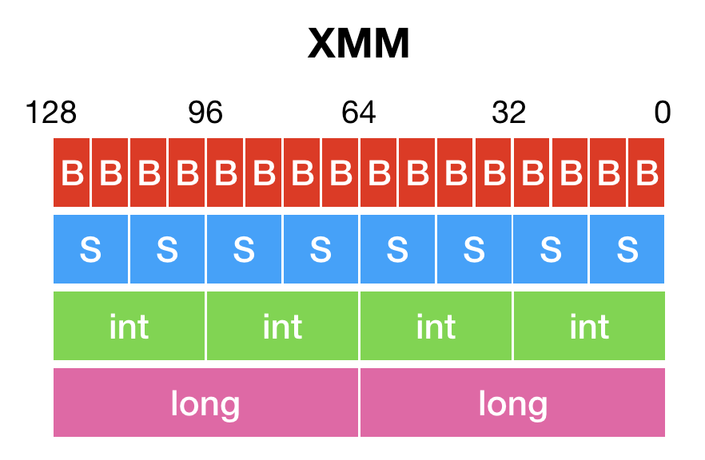
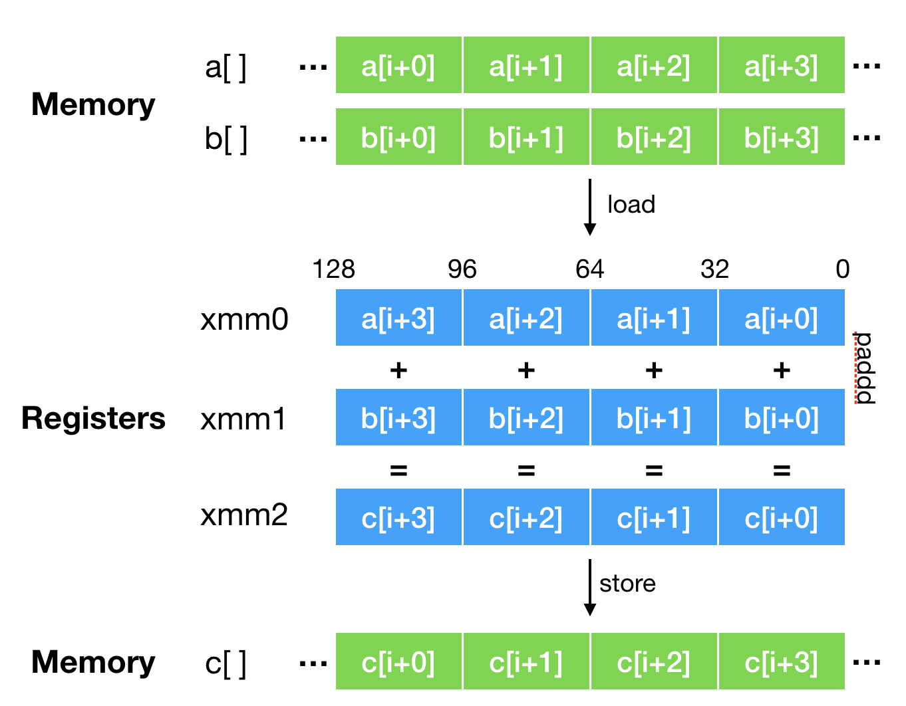

# 向量化

一个题目：如何进一步优化下面这段代码。
~~~java
void foo(byte[] dst, byte[] src) {
    for (int i = 0; i< dst.length - 4; i += 4) {
        dst[i] = src[i];
        dst[i+1] = src[i+1];
        dst[i+2] = src[i+2];
        dst[i+3] = src[i+3];
    }
    ... // post-loop
}
~~~
由于X86_64平台不支持内存间的直接移动，上面代码中的<code>dst[i] = src[i]</code>通常会被编译为两条内存访问指令：第一条指令把<code>src[i]</code>的值读取至寄存器中，而第二条指令则把寄存器中的值写入至<code>dst[i]</code>中。

因此，上面这段代码中的一个循环迭代将会执行四条内存读取指令，以及四条内存写入指令。

由于数组元素在内存中是连续的，当从<code>src[i]</code>的内存地址处读取32位的内容时，我们将一并读取<code>src[i]</code>至<code>src[i+3]</code>的值。同样，当向<code>dst[i]</code>的内存地址处写入32位的内容时，我们将一并写入<code>dst[i]</code>至<code>dst[i+3]</code>的值。

通过综合这两个批量操作，我们可以使用一条内存读取指令以及一条内存写入指令，完成上面代码中循环体内的全部工作。如果我们用<code>x[i:i+3]</code>来指代<code>x[i]</code>至<code>x[i+3]</code>合并后的值，那么上述优化可以被表述成如下所示的代码：
~~~java
void foo(byte[] dst, byte[] src) {
    for (int i = 0; i< dst.length - 4; i += 4) {
        dst[i:i+3] = src[i:i+3];
    }
    ... // post-loop
    }
~~~

## SIMD指令

在前面的示例中，我们使用的是byte数组，四个数组元素并起来也才4个字节。如果换成int数组，或者long数组，那么四个数组元素并起来将会是16字节或32字节。

我们知道，X86_64体系架构上通用寄存器的大小为64位（即8个字节），无法暂存这些超长的数据。因此，即时编译器将借助长度足够的XMM寄存器，来完成int数组与long数组的向量化读取和写入操作。（为了实现方便，byte数组的向量化读取、写入操作同样使用了XMM寄存器。）

所谓的XMM寄存器，是由SSE（Streaming SIMD Extensions）指令集所引入的。它们一开始仅为128位。自从X86平台上的CPU开始支持AVX（Advanced Vector Extensions）指令集后（2011年），XMM寄存器便升级为256位，并更名为YMM寄存器。原本使用XMM寄存器的指令，现将使用YMM寄存器的低128位。

前几年推出的AVX512指令集，更是将YMM寄存器升级至512位，并更名为ZMM寄存器。HotSpot虚拟机也紧跟时代，更新了不少基于AVX512指令集以及ZMM寄存器的优化。不过，支持AVX512指令集的CPU都比较贵，目前在生产环境中很少见到。

SSE指令集以及之后的AVX指令集都涉及了一个重要的概念，那便是单指令流多数据流（Single Instruction Multiple Data，SIMD），即通过单条指令操控多组数据的计算操作。这些指令我们称之为SIMD指令。

SIMD指令将XMM寄存器（或YMM寄存器、ZMM寄存器）中的值看成多个整数或者浮点数组成的向量，并且批量进行计算。

举例来说，128位XMM寄存器里的值可以看成16个byte值组成的向量，或者8个short值组成的向量，4个int值组成的向量，两个long值组成的向量；而SIMD指令<code>PADDB</code>、<code>PADDW</code>、<code>PADDD</code>以及<code>PADDQ</code>，将分别实现byte值、short值、int值或者long值的向量加法。
~~~java
void foo(int[] a, int[] b, int[] c) {
    for (int i = 0; i< c.length; i++) {
        c[i] = a[i] + b[i];
    }
}
~~~

上面这段代码经过向量化优化之后，将使用<code>PADDD</code>指令来实现<code>c[i:i+3] = a[i:i+3] + b[i:i+3]</code>。其执行过程中的数据流如下图所示，图片源自Vladimir Ivanov的演讲[1]。下图中内存的右边是高位，寄存器的左边是高位，因此数组元素的顺序是反过来的。

也就是说，原本需要<code>c.length</code>次加法操作的代码，现在最少只需要<code>c.length/4</code>次向量加法即可完成。因此，SIMD指令也被看成CPU指令级别的并行。

>这里<code>c.length/4</code>次是理论值。现实中，C2还将考虑缓存行对齐等因素，导致能够应用向量化加法的仅有数组中间的部分元素。

## 使用SIMD指令的HotSpot Intrinsic<

SIMD指令虽然非常高效，但是使用起来却很麻烦。这主要是因为不同的CPU所支持的SIMD指令可能不同。一般来说，越新的SIMD指令，它所支持的寄存器长度越大，功能也越强。

>目前几乎所有的X86_64平台上的CPU都支持SSE指令集，绝大部分支持AVX指令集，三四年前量产的CPU支持AVX2指令集，最近少数服务器端CPU支持AVX512指令集。AVX512指令集的提升巨大，因为它不仅将寄存器长度增大至512字节，而且引入了非常多的新指令。

为了能够尽量利用新的SIMD指令，我们需要提前知道程序会被运行在支持哪些指令集的CPU上，并在编译过程中选择所支持的SIMD指令中最新的那些。

或者，我们可以在编译结果中纳入同一段代码的不同版本，每个版本使用不同的SIMD指令。在运行过程中，程序将根据CPU所支持的指令集，来选择执行哪一个版本。

>虽然程序中包含当前CPU可能不支持的指令，但是只要不执行到这些指令，程序便不会出问题。如果不小心执行到这些不支持的指令，CPU会触发一个中断，并向当前进程发出<code>sigill</code>信号。

不过，这对于使用即时编译技术的Java虚拟机来说，并不是一个大问题。

我们知道，Java虚拟机所执行的Java字节码是平台无关的。它首先会被解释执行，而后反复执行的部分才会被Java虚拟机即时编译为机器码。换句话说，在进行即时编译的时候，Java虚拟机已经运行在目标CPU之上，可以轻易地得知其所支持的指令集。

然而，Java字节码的平台无关性却引发了另一个问题，那便是Java程序无法像C++程序那样，直接使用由Intel提供的，将被替换为具体SIMD指令的intrinsic方法[2]。

HotSpot虚拟机提供的替代方案是Java层面的intrinsic方法，这些intrinsic方法的语义要比单个SIMD指令复杂得多。在运行过程中，HotSpot虚拟机将根据当前体系架构来决定是否将对该intrinsic方法的调用替换为另一高效的实现。如果不，则使用原本的Java实现。

举个例子，Java 8中<code>Arrays.equals(int[], int[])</code>的实现将逐个比较int数组中的元素。
~~~java
public static boolean equals(int[] a, int[] a2) {
    if (a==a2)
        return true;
    if (a==null || a2==null)
        return false;
    int length = a.length;
    if (a2.length != length)
        return false;
    // 关键循环
    for (int i=0; i<length; i++)
        if (a[i] != a2[i])
            return false;
    return true;
}
~~~

对应的intrinsic高效实现会将数组的多个元素加载至XMM/YMM/ZMM寄存器中，然后进行按位比较。如果两个数组相同，那么其中若干个元素合并而成的值也相同，其按位比较也应成功。反过来，如果按位比较失败，则说明两个数组不同。

使用SIMD指令的HotSpot intrinsic是虚拟机开发人员根据其语义定制的，因而性能相当优越。

不过，由于开发成本及维护成本较高，这种类型的intrinsic屈指可数，如用于复制数组的<code>System.arraycopy</code>和<code>Arrays.copyOf</code>，用于比较数组的<code>Arrays.equals</code>，以及Java 9新加入的<code>Arrays.compare</code>和<code>Arrays.mismatch</code>，以及字符串相关的一些方法<code>String.indexOf</code>、<code>StringLatin1.inflate</code>。

><code>Arrays.copyOf</code>将调用<code>System.arraycopy</code>，实际上只有后者是intrinsic。在Java 9之后，数组比较真正的intrinsic是<code>ArraySupports.vectorizedMismatch</code>方法，而<code>Arrays.equals</code>、<code>Arrays.compare</code>和<code>Arrays.mismatch</code>将调用至该方法中。

另外，这些intrinsic方法只能做到点覆盖，在不少情况下，应用程序并不会用到这些intrinsic的语义，却又存在向量化优化的机会。这个时候，我们便需要借助即时编译器中的自动向量化（auto vectorization）。

## 自动向量化

即时编译器的自动向量化将针对能够展开的计数循环，进行向量化优化。如前面介绍过的这段代码，即时编译器便能够自动将其展开优化成使用<code>PADDD</code>指令的向量加法。
~~~java
void foo(int[] a, int[] b, int[] c) {
    for (int i = 0; i< c.length; i++) {
        c[i] = a[i] + b[i];
    }
}
~~~
关于计数循环的判定，我在上一篇介绍循环优化时已经讲解过了，这里我补充几点自动向量化的条件。

循环变量的增量应为1，即能够遍历整个数组。

循环变量不能为long类型，否则C2无法将循环识别为计数循环。

循环迭代之间最好不要有数据依赖，例如出现类似于<code>a[i] = a[i-1]</code>的语句。当循环展开之后，循环体内存在数据依赖，那么C2无法进行自动向量化。

循环体内不要有分支跳转。

不要手工进行循环展开。如果C2无法自动展开，那么它也将无法进行自动向量化。

我们可以看到，自动向量化的条件较为苛刻。而且，C2支持的整数向量化操作并不多，据我所致只有向量加法，向量减法，按位与、或、异或，以及批量移位和批量乘法。C2还支持向量点积的自动向量化，即两两相乘再求和，不过这需要多条SIMD指令才能完成，因此并不是十分高效。

为了解决向量化intrinsic以及自动向量化覆盖面过窄的问题，我们在OpenJDK的Paname项目[3]中尝试引入开发人员可控的向量化抽象。

该抽象将提供一套通用的跨平台API，让Java程序能够定义诸如<code>IntVector<S256Bits></code>的向量，并使用由它提供的一系列向量化intrinsic方法。即时编译器负责将这些intrinsic的调用转换为符合当前体系架构/CPU的SIMD指令。如果你感兴趣的话，可以参考Vladimir Ivanov今年在JVMLS上的演讲[4]。

## 总结与实践

今天我介绍了即时编译器中的向量化优化。

向量化优化借助的是CPU的SIMD指令，即通过单条指令控制多组数据的运算。它被称为CPU指令级别的并行。

HotSpot虚拟机运用向量化优化的方式有两种。第一种是使用HotSpot intrinsic，在调用特定方法的时候替换为使用了SIMD指令的高效实现。Intrinsic属于点覆盖，只有当应用程序明确需要这些intrinsic的语义，才能够获得由它带来的性能提升。

第二种是依赖即时编译器进行自动向量化，在循环展开优化之后将不同迭代的运算合并为向量运算。自动向量化的触发条件较为苛刻，因此也无法覆盖大多数用例。

今天的实践环节，我们来观察一下即时编译器的自动向量化的自适配性。

在支持256位YMM寄存器的机器上，C2会根据循环回边的执行次数以及方法的执行次数来推测每个循环的次数。如果超过一定值，C2会采用基于256位YMM寄存器的指令，相比起基于128位XMM寄存器的指令而言，单指令能处理的数据翻了一倍。

请采用Java 9以上的版本运行下述代码。（Java 8始终采用基于128位XMM寄存器指令的Bug可能仍未修复。）
~~~java
// Run with 
// java -XX:CompileCommand='dontinline VectorizationTest.foo' -XX:CompileCommand='print VectorizationTest.foo' -XX:-TieredCompilation VectorizationTest

public class VectorizationTest {
    static void foo(int[] a, int[] b, int[] c) {
        for (int i = 0; i< a.length; i++) {
            c[i] = a[i] + b[i];
        }
    }

    public static void main(String[] args) throws InterruptedException {
        int[] a = new int[] { 1, 2, 3, 4, 5, 6, 7, 8, 1, 2, 3, 4, 5, 6, 7, 8 };
        int[] c = new int[16];
        for (int i = 0; i< 20_000; i++) {
            foo(a, a, c);
        }
        Thread.sleep(2000);
    }
}
~~~
输出将包含如下机器码：
~~~
0x000000011ce7c650: vmovdqu xmm0,XMMWORD PTR [rdx+rbx*4+0x10]
0x000000011ce7c656: vpaddd xmm0,xmm0,XMMWORD PTR [rsi+rbx*4+0x10]
0x000000011ce7c65c: vmovdqu XMMWORD PTR [rcx+rbx*4+0x10],xmm0
~~~
如果替换为：
~~~
int[] a = new int[] { 1, 2, 3, 4, 5, 6, 7, 8, 1, 2, 3, 4, 5, 6, 7, 8, 1, 2, 3, 4, 5, 6, 7, 8, 1, 2, 3, 4, 5, 6, 7, 8 };
int[] c = new int[32];
~~~
输出将包含如下机器码：
~~~
0x000000010ff04d9c: vmovdqu ymm0,YMMWORD PTR [rdx+rbx*4+0x10]
0x000000010ff04da2: vpaddd ymm0,ymm0,YMMWORD PTR [rsi+rbx*4+0x10]
0x000000010ff04da8: vmovdqu YMMWORD PTR [rcx+rbx*4+0x10],ymm0

---
~~~
  
你可以将<code>foo</code>方法更改为下述代码：

~~~java
static void foo(int[] a) {
    for (int i = 4; i< a.length; i++) {
        a[i] = a[i - 4];
    }
}
~~~
 重复上述实验，看看会发生什么。
 
> 引用

 1. [2017_Vectorization_in_HotSpot_JVM.pdf](http://cr.openjdk.java.net/~vlivanov/talks/2017_Vectorization_in_HotSpot_JVM.pdf)

 2. [IntrinsicsGuide](https://software.intel.com/sites/landingpage/IntrinsicsGuide)

 3. [panama](http://openjdk.java.net/projects/panama)

 4. [2018_JVMLS_VectorAPI](http://cr.openjdk.java.net/~vlivanov/talks/2018_JVMLS_VectorAPI.pdf)
