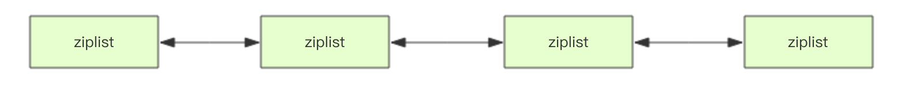

##基础：万丈高楼平地起 —— Redis 基础数据结构

千里之行，始于足下。本节我们的学习目标是：快速理解并掌握 Redis 的基础知识。

由于本节内容是 Redis 最简单最容易掌握的知识，如果读者已经很熟悉 Redis 的基础数据结构，从珍惜生命的角度出发，你可以略过本节内容，跳到下一节继续阅读。如果你觉得本节的动画有点晃眼，阅读起来不那么舒服，可以看看作者的另一篇文章《Redis 数据结构基础教程》。

要体验 Redis，我们先从 Redis 安装说起。

## Redis 安装

体验 Redis 需要使用 Linux 或者 Mac 环境，如果是 Windows 可以考虑使用虚拟机。主要方式有四种：

使用 Docker 安装。
通过 Github 源码编译。
直接安装 apt-get install(Ubuntu)、yum install(RedHat) 或者 brew install(Mac)。
如果读者懒于安装操作，也可以使用网页版的 Web Redis 直接体验。
具体操作如下：

### Docker 方式

~~~bash
# 拉取 redis 镜像
> docker pull redis
# 运行 redis 容器
> docker run --name myredis -d -p6379:6379 redis
# 执行容器中的 redis-cli，可以直接使用命令行操作 redis
> docker exec -it myredis redis-cli
~~~

### Github 源码编译方式

~~~bash
# 下载源码
> git clone --branch 2.8 --depth 1 git@github.com:antirez/redis.git
> cd redis
# 编译
> make
> cd src
# 运行服务器，daemonize表示在后台运行
> ./redis-server --daemonize yes
# 运行命令行
> ./redis-cli
~~~

### 直接安装方式

~~~bash
# mac
> brew install redis
# ubuntu
> apt-get install redis
# redhat
> yum install redis
# 运行客户端
> redis-cli
~~~

### Redis 基础数据结构

Redis 有 5 种基础数据结构，分别为：string (字符串)、list (列表)、set (集合)、hash (哈希) 和 zset (有序集合)。熟练掌握这 5 种基本数据结构的使用是 Redis 知识最基础也最重要的部分，它也是在 Redis 面试题中问到最多的内容。

本节将带领 Redis 初学者快速通关这 5 种基本数据结构。考虑到 Redis 的命令非常多，这里只选取那些最常见的指令进行讲解，如果有遗漏常见指令，读者可以在评论去留言。

### string (字符串)
字符串 string 是 Redis 最简单的数据结构。Redis 所有的数据结构都是以唯一的 key 字符串作为名称，然后通过这个唯一 key 值来获取相应的 value 数据。不同类型的数据结构的差异就在于 value 的结构不一样。

字符串结构使用非常广泛，一个常见的用途就是缓存用户信息。我们将用户信息结构体使用 JSON 序列化成字符串，然后将序列化后的字符串塞进 Redis 来缓存。同样，取用户信息会经过一次反序列化的过程。

Redis 的字符串是动态字符串，是可以修改的字符串，内部结构实现上类似于 Java 的 ArrayList，采用预分配冗余空间的方式来减少内存的频繁分配，如图中所示，内部为当前字符串实际分配的空间 capacity 一般要高于实际字符串长度 len。当字符串长度小于 1M 时，扩容都是加倍现有的空间，如果超过 1M，扩容时一次只会多扩 1M 的空间。需要注意的是字符串最大长度为 512M。

### 键值对

~~~bash
> set name codehole
OK
> get name
"codehole"
> exists name
(integer) 1
> del name
(integer) 1
> get name
(nil)
~~~

### 批量键值对

可以批量对多个字符串进行读写，节省网络耗时开销。

~~~bash
> set name1 codehole
OK
> set name2 holycoder
OK
> mget name1 name2 name3 # 返回一个列表
1) "codehole"
2) "holycoder"
3) (nil)
> mset name1 boy name2 girl name3 unknown
> mget name1 name2 name3
1) "boy"
2) "girl"
3) "unknown"
~~~

### 过期和 set 命令扩展

可以对 key 设置过期时间，到点自动删除，这个功能常用来控制缓存的失效时间。不过这个「自动删除」的机制是比较复杂的，

~~~bash
> set name codehole
> get name
"codehole"
> expire name 5  # 5s 后过期
...  # wait for 5s
> get name
(nil)

> setex name 5 codehole  # 5s 后过期，等价于 set+expire
> get name
"codehole"
... # wait for 5s
> get name
(nil)

> setnx name codehole  # 如果 name 不存在就执行 set 创建
(integer) 1
> get name
"codehole"
> setnx name holycoder
(integer) 0  # 因为 name 已经存在，所以 set 创建不成功
> get name
"codehole"  # 没有改变...
~~~

### 计数

如果 value 值是一个整数，还可以对它进行自增操作。自增是有范围的，它的范围是 signed long 的最大最小值，超过了这个值，Redis 会报错。
~~~bash
> set age 30
OK
> incr age
(integer) 31
> incrby age 5
(integer) 36
> incrby age -5
(integer) 31
> set codehole 9223372036854775807  # Long.Max
OK
> incr codehole
(error) ERR increment or decrement would overflow...
~~~

字符串是由多个字节组成，每个字节又是由 8 个 bit 组成，如此便可以将一个字符串看成很多 bit 的组合，这便是 bitmap「位图」数据结构

### list (列表)

Redis 的列表相当于 Java 语言里面的 LinkedList，注意它是链表而不是数组。这意味着 list 的插入和删除操作非常快，时间复杂度为 O(1)，但是索引定位很慢，时间复杂度为 O(n)，这点让人非常意外。

当列表弹出了最后一个元素之后，该数据结构自动被删除，内存被回收。

Redis 的列表结构常用来做异步队列使用。将需要延后处理的任务结构体序列化成字符串塞进 Redis 的列表，另一个线程从这个列表中轮询数据进行处理。

### 右边进左边出：队列

~~~bash
> rpush books python java golang
(integer) 3
> llen books
(integer) 3
> lpop books
"python"
> lpop books
"java"
> lpop books
"golang"
> lpop books
(nil)...
~~~

### 右边进右边出：栈

~~~bash
> rpush books python java golang
(integer) 3
> rpop books
"golang"
> rpop books
"java"
> rpop books
"python"
> rpop books
(nil)...
~~~

### 慢操作

lindex 相当于 Java 链表的`get(int index)`方法，它需要对链表进行遍历，性能随着参数`index`增大而变差。

ltrim 和字面上的含义不太一样，个人觉得它叫 lretain(保留) 更合适一些，因为 ltrim 跟的两个参数`start_index`和`end_index`定义了一个区间，在这个区间内的值，ltrim 要保留，区间之外统统砍掉。我们可以通过ltrim来实现一个定长的链表，这一点非常有用。

index 可以为负数，`index=-1`表示倒数第一个元素，同样`index=-2`表示倒数第二个元素。

~~~bash
> rpush books python java golang
(integer) 3
> lindex books 1  # O(n) 慎用
"java"
> lrange books 0 -1  # 获取所有元素，O(n) 慎用
1) "python"
2) "java"
3) "golang"
> ltrim books 1 -1 # O(n) 慎用
OK
> lrange books 0 -1
1) "java"
2) "golang"
> ltrim books 1 0 # 这其实是清空了整个列表，因为区间范围长度为负
OK
> llen books
(integer) 0
~~~

### 快速列表

如果再深入一点，你会发现 Redis 底层存储的还不是一个简单的 linkedlist，而是称之为快速链表 quicklist 的一个结构。

首先在列表元素较少的情况下会使用一块连续的内存存储，这个结构是 ziplist，也即是压缩列表。它将所有的元素紧挨着一起存储，分配的是一块连续的内存。当数据量比较多的时候才会改成 quicklist。因为普通的链表需要的附加指针空间太大，会比较浪费空间，而且会加重内存的碎片化。比如这个列表里存的只是 int 类型的数据，结构上还需要两个额外的指针 prev 和 next 。所以 Redis 将链表和 ziplist 结合起来组成了 quicklist。也就是将多个 ziplist 使用双向指针串起来使用。这样既满足了快速的插入删除性能，又不会出现太大的空间冗余。

